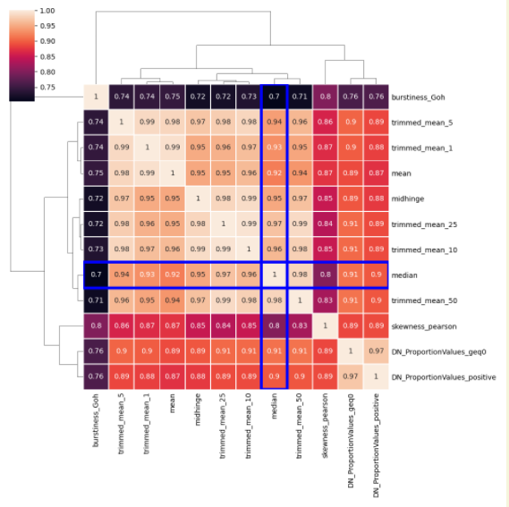

# GSoC Final Report
##### Organization : International Neuroinformatics Coordinating Facility (INCF)
##### Project      : Automated comparison of scientific methods for time series analysis.
##### Student      : Salman Khan
##### Mentors      : Ben Fulcher, Oliver Cliff, Joseph Lizier

### Introduction

In this **Google Summer of Code 2020** project I developed a web-based system that helps the user to compare new time-series analysis algorithms to a collection of over 7700 existing algorithms, implemented as the [_hctsa_ package](https://github.com/benfulcher/hctsa).
The website takes a new time-series analysis algorithm (as python code) from the user and computes its outputs across a [dataset of 1000 diverse time series](https://figshare.com/articles/1000_Empirical_Time_series/5436136).
It then analyzes the correlation between the output of the user's algorithm with the _hctsa_ feature library and presents a range of intuitive output visualizations that show the best-matching features.
This output helps the user to understand connections between their method and the existing interdisciplinary time-series analysis literature, and therefore to assess whether their algorithm is really contributing progress to the literature.

Here is an example of the website functionality I developed from scratch in this GSoC project:

### What was done
Since the project needs to be developed from scratch, I have broken down the development process into three parts:  

1. **First phase - Backend / logic development**  
&nbsp; _I developed a series of functions to enable successful execution of the user's code, and to perform systematic comparison of its output to that of existing algorithms:_  

   * Read the user's code as a string to check for malicious code before execution.
   * Passes a diverse time-series dataset through user's function and generate long feature vector.
   * Compute the Spearman correlation coefficient between the computed feature vector and with every individual <em>hctsa</em> feature, and sort and store all of the relevant information: (Feature name, Keywords, _p_-value, Correlation coefficient).
   * Structure the results for rendering in a dynamic table and interactive plotting.

2. **Second phase - Front-end development**  
&nbsp; _In this phase, I focused on front-end development, that will be used by the user.I implemented a range of functionality, including:_  

   * Development of pages for websites, including 'Home', 'How-it-works', 'Contact', 'Preloader', 'Result', 'Syntax error', 'Timeout Error', and '404 Not found'.
   * Interactive results table (functionality shown in the gif below), that allows users to:
      * Toggle to change representation of results.
      * Download all results in .csv format.
      * Toggle button to view table in full size.
      * Choose show / hide column from table.
      
   * Visualization of top 12 results as interactive scatter plots (as visualized in the gif below), which enables users to:
      * Hover to see data points.
      * Zoom each plot or all subplots simultaneously to more clearly visualize the relationships.
      
   * Visualization of pairwise relationships between each of the top 12 matches as a correlation heatmap reordered using linkage clustering.
      
      

3. **Third phase - Running user's code securely and with error handling.**  
&nbsp; _This was one of the major challenges, as executing custom user code on a server could compromise the system.Thus, in order to run user's code safely, we:_  

   * Used RestrictedPython to run the user's code in a restricted environment.
   * Allow the user to import only specific modules that are relevant to scientific data analysis, and thus disabling functionality related to accessing/modifying the system.
   * Restricted in-built functions like exec or eval that could be used to harm the system.
   * Added a timeout limit so that the system is protected from algorithms falling into an infinite loop.
<!-- <li>Handled other possible errors like Syntax error, 404 page not found, and Timeout error. -->

### Link to work
* [Link to full repository](https://github.com/NeuralSystemsAndSignals/Comp-Engine-Features)
* [Links for all commits](https://github.com/NeuralSystemsAndSignals/Comp-Engine-Features/commits/master)

### Weekly Reports
_These are the weekly reports that i had submitted to INCF during GSoC period:_

* [Week 1 & Week 2](https://drive.google.com/file/d/1DKX11fXbYbpREzT8H0AB5Vdq8xSzLO8u/view?usp=sharing)
* [Week 3](https://drive.google.com/file/d/12lr42BS4PyOyBUC1cqbAaYDeUksdllxe/view?usp=sharing)
* [Week 4](https://drive.google.com/file/d/1tuV2kLixLSpDSst-rc-eXj4rhZbz_qRD/view?usp=sharing)
* [Week 5](https://drive.google.com/file/d/1GFv2RhH4dg96NdV-CrnO9bd1RFiPVMU-/view?usp=sharing)
* [Week 6](https://drive.google.com/file/d/18O2VJ8uYRXfamjCmKa0Cq0Z6MYyw5nMU/view?usp=sharing)
* [Week 7](https://drive.google.com/file/d/1ket_4KNNlxDDR6v5ec2s3zPjcN3RSA8B/view?usp=sharing)
* [Week 8](https://drive.google.com/file/d/179jS-Ztb675IzxVpvI9Y-fvxnvsq-oRC/view?usp=sharing)
* [Week 9](https://drive.google.com/file/d/1uTio6VrW_wJp66dp83JSSduzNPK8g6T0/view?usp=sharing)
* [Week 10](https://drive.google.com/file/d/1PAvLqlv8p7_tm2dWcwDtFrH4Fp-rOYxd/view?usp=sharing)
* [Week 11](https://drive.google.com/file/d/1PumTCAHoR7FEz21GVpolGOb6o0J14Khd/view?usp=sharing)
* [Week 12](https://drive.google.com/file/d/10CzCYMVjRRHOa4Khtgkno3oRTgbn06p7/view?usp=sharing)  

---
### Future Work
Although all the requirements of this project as outlined in the GSoC proposal have been completed, this project represents the important initial steps in the full development of _CompEngine-Features_. After the official GSoC period, I plan to contribute to this further development by:
   * Adding an explore mode by which user can compare already exisiting features.
   * Adding a nested result table clicking on any result will take to other result table of similar features.
   * Implementing additional visualizations, including a network visualization.
